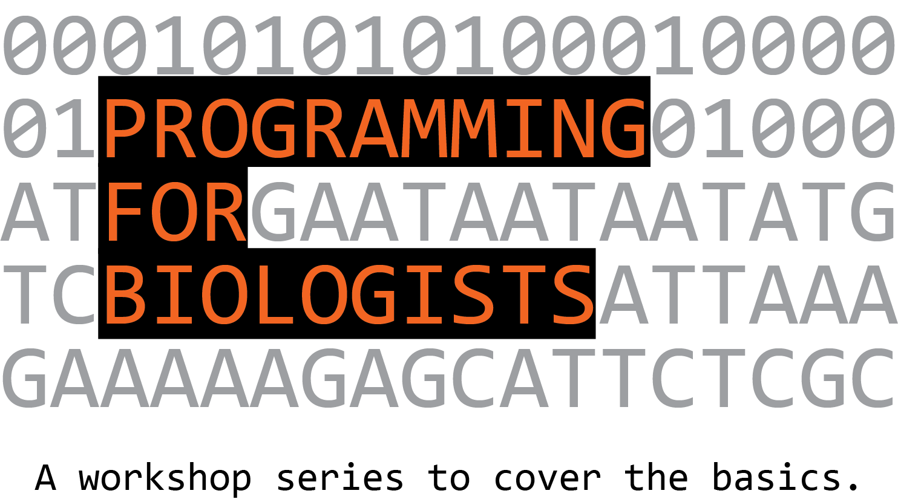

# Programming for Biologists

The group is focused at the Northwestern University Chicago Campus and is open to all members of the Northwestern community. The goals of the group are:

1. Introduce skills for researchers to conduct basic manipulations, run published software, and begin to write software themselves.
2. To serve as a networking opportunity and launch pad for additional training and research collaboration.

To achieve these goals, the group runs workshops, maintains a user group, and will begin to put together more advanced groups.

The activities of the group are made possible with strong support from [Research Computing](http://www.it.northwestern.edu/research/).

## Updated Calendar of Events

[Planit Purple](http://planitpurple.northwestern.edu/calendar/4084)

Please also see links to other [related events](related.md).

## User Group

The group meets weekly, Thursdays at 10:30 am - 12:00 pm. This is an opportunity to follow up on the previous workshop material or to move into new areas. Work is self-directed. See the calendar for specific dates and locations.

## Workshops

| Title | Presenter | Date |
| ----- | --------- | ---- |
| [Introduction to the Command Line](workshops/command-line-2015-09-24.md) | Jackie Milhans | September 24, 2015 |
| [Software Carpentry Workshop](http://xuf12.github.io/2015-11-10-northwesternu/) | Sarah Stevens, Jackie Milhans, Xu Fei | November 10-11, 2015 |

## Listserv

To join the listserv send a message to listserv@listserv.it.northwestern.edu with the following in the body (not subject) of the message, filled in with your information:

`SUBSCRIBE BIOCODING user@domain.edu Firstname Lastname`

## Contact

[Mark Mandel](m-mandel@northwestern.edu)

## Branding

Some ninja Googling has revealed that this fairly generic name "Programming for Biologists" is already in use in [Ethan White's Programming for Biologists Curriculum](http://www.programmingforbiologists.org). To avoid any confusion a goal for Spring 2016 will be to rebrand this group as something Northwestern-specific. Names & logo ideas are welcome!
